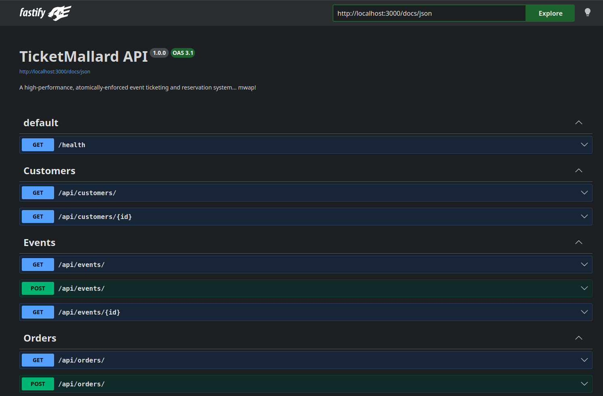
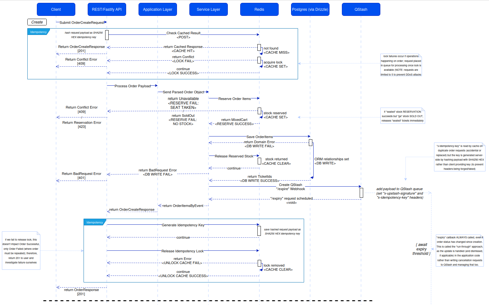
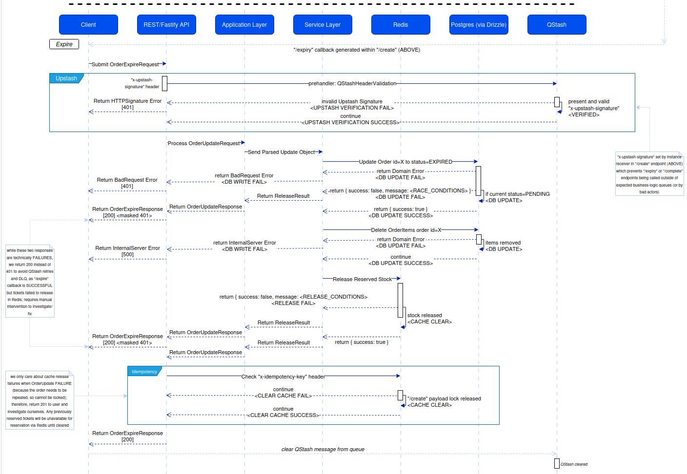
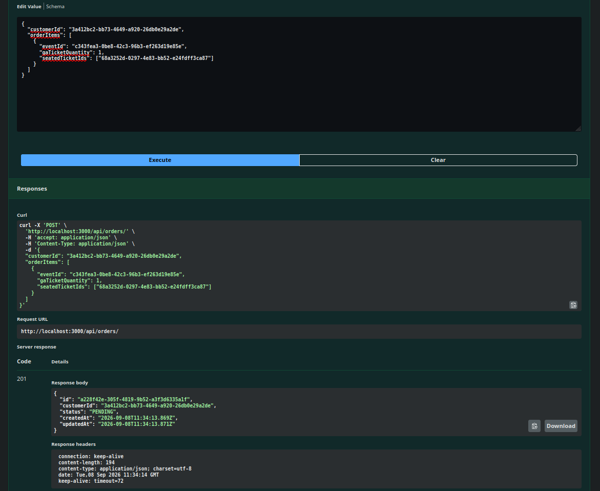
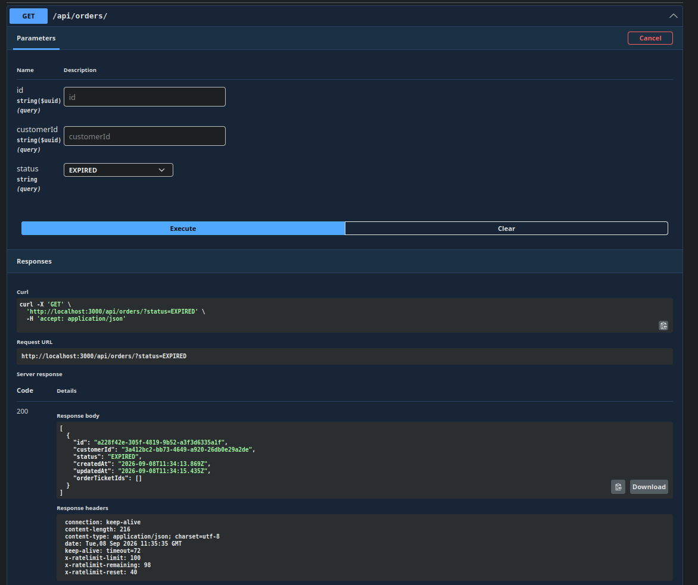
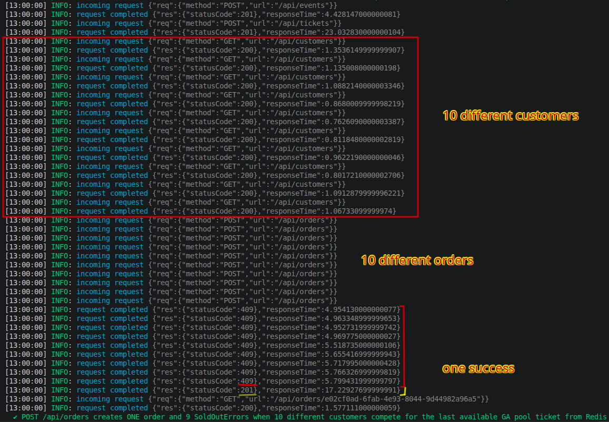
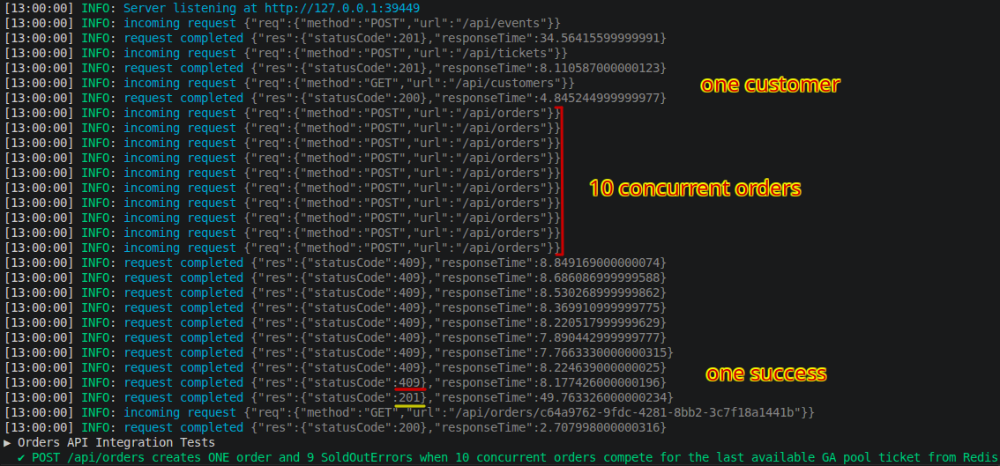
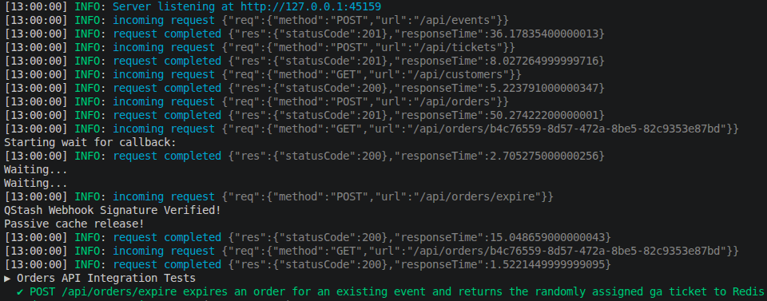

# TicketMallard

### "Duck out of Ticketmaster and pool your tickets here!"

[NOTE: I only found out after-the-fact that "Design Ticketmaster" is a common interview question/design problem online! I can honestly say I chose it because it suited the challenge and skill-building I was looking for... a happy accident!]

## 📌 Table of Contents

- About the Project
- Built With
- Features
- Screenshots / Demo

---

## 📖 About The Project

This project started out as a way for me to learn how to safeguard a high-concurrency REST api using two technologies I had no prior experience of: Redis, and a queue-based message broker (in this case, QStash).

I knew of them in principle, but - as always - putting the knowledge into practice revealed the pitfalls and shortcomings for which such systems are known. One particular instance came from the "/expire" endpoint and how (once the original order had been expired) we _no longer_ wanted to return the cached 201 OrderResponse, as it's possible the same request from the same customer could be placed again.

My solution was to pass the cached response's server-side idempotency key as an "x-idempotency-key" header to the generated the "/expire" request and add it to QStash to fire after a pre-defined amount of time, but this opened the doors to client requests fudging/forging "x-idempotency-key" headers - so I introduced a "x-upstash-signature" signing key generated from the QStash receiver to guard against outside sources being able to call this endpoint in the first place - but _now_ I had to write a preHandler function for Fastify to be able to intercept these calls, except some of my INT tests required that this key is invalid so I could determine whether I was handling these requests correctly - so _NOW_ I had to write a signing key header bypass to be able to--and on and on...

But once the HTTP requests were appropriately throttled and queued, it was time to tackle the biggest challenge of a high-traffic ticketing system: ACID integrity of a rapidly mutating relational database.

---

**CONTEXT:**

A database is said to conform to ACID principles when it enforces: **ATOMICITY**, **CONSISTENCY**, **ISOLATION**, and **DURABILITY**.

#### 🔹 _*ATOMICITY:*_

the control of transactioning; if one part fails, everything should roll back

> particularly difficult when using Redis as a cache buffer for your RDBMS, as you have to lock/mutate different resources in different orders depending on if you're adding or removing ticket stock

#### 🔹 _*CONSISTENCY:*_

moving data from one valid state to another

> for example, do you mark the order as expired before or after freeing the tickets for reserving by someone else? Your decision (and how you handle the moving pieces) can put data in the troublesome spot of being associated with different entities

#### 🔹 _*ISOLATION:*_

concurrent operations cannot overlap

> idempotency locks on orders (and their assigned data relationships) via Lua scripts can ensure an execution flow, but not that the execution flow will be desired or successful

#### 🔹 _*DURABILITY:*_

that the data stays safe

> Redis stores data in memory (which is wiped upon crashing) and Postgres retains data in SQL tables... but which is the truth at a specific point in time?

---

What follows is a deconstruction of my development process, including which architectural decisions I made, assumptions I had to define, and anticipation of system behaviours we'd have to account for.

Enjoy!

Mitch

---

## 🛠️ Built With

- [TypeScript](https://www.typescriptlang.org/)
- [Node.js](https://nodejs.org/)
- [Docker](https://docker.com/)
- [QStash](https://upstash.com/)
- [Drizzle](https://orm.drizzle.team/)
- [Fastify](https://fastify.dev/)
- [Swagger](https://swagger.io/)
- [Postgres](https://www.postgresql.org/)
- [Redis](https://www.postgresql.org/)

---

## ✨ Features

Some parts of the project to pay attention to:

- **Drizzle/Postgres Schemas:** - built the ORM tables straight from defined schemas that drizzle-push any changes to the db. zod was also incorporated for type-safe instantiation of these schemas
- **Idempotency Hooks:** - _idempotency.hooks.ts_, wiring "preHandler", "onSend", and "onResponse" hooks into Fastify to manage locking and cache returns at the REST api layer
- **Fastify Routing:** - see the many /route/ files incorporating FastifyPluginAsyncZod to parse request/response schemas on the fly (no boilerplate for us!)
- **Services Layers:** - see _order.services.ts_ in particular to view the heart of the application, where ACID adherence is enforced via error handling, Redis rollbacks, and callback generation
- **Redis and Lua:** - _redis.ts_ contains the atomic operations for reserving/releasing ticket stock, pushing excess requests into a command queue to ensure no message is left behind
- **INT testing:** - the proof is in the pudding for all the files under the /test/ folder; see for yourself how the system handles rate limiting and concurrent orders, hammering endpoints with multiple customers at millisecond latency and never over-selling or under-serving stock

---

## 📸 Screenshots

  <h3>Architecture & Order Lifecycle Flow</h3>
  
<em>Mapping out the application layers and state transitions of a <code>/create</code> order request, highlighting the role of idempotency and the use of Redis to reallocate operational stress.</em>

  

  
<em>The following workflow of the <code>/expire</code> order request added to QStash and executed after grace period has elapsed.</em>

  

  <h3>Swagger-generated API Docs</h3>
  
<em>Showing the REST api endpoints in action, and that orders can indeed be placed/expired.</em>

  

  

  <h3>Testing: Load/High-frequency Demand</h3>
  
<em>Two examples from the INT test files, showing multiple customers making individual orders (and an individual customer making multiple orders) for the same General Admission ticket, providing concurrency control and millisecond responses to all.</em>

  

  

  <h3>Testing: Webhooks and QStash Verification</h3>
  
<em>The "/expire" endpoint being called 2 seconds after the order has been placed, expiring the hold on the order items and clearing the order from the cache.</em>

  

